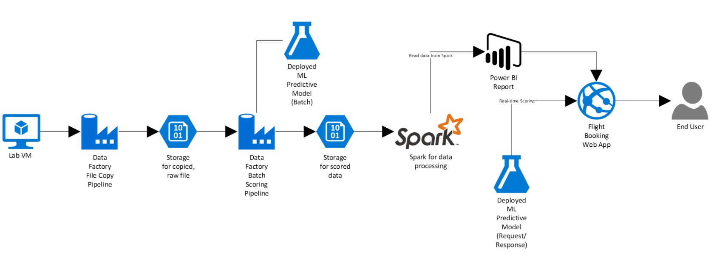

## Abstract and learning objectives

In this workshop, you will build a complete Azure Machine Learning (ML) model for predicting if an upcoming flight will experience delays, based on flight data and weather conditions. In addition, you will learn to:
* Develop a data factory pipeline for data movement
* Analyze data using Spark on HDInsight
* Build and operationalize a Machine Learning model for predictions
* Visualize Big Data and predictions using Power BI Desktop

This hands-on lab is designed to provide exposure to many of Microsoft’s transformative line of business applications built using Microsoft big data and advanced analytics. The goal is to show an end-to-end solution, leveraging many of these technologies, but not necessarily doing work in every component possible. The lab architecture is below and includes:
* Azure Machine Learning (Azure ML)
* Azure Data Factory (ADF)
* Azure Storage
* HDInsight Spark
* Power BI Desktop
* Azure App Service

## Overview

AdventureWorks Travel (AWT) provides concierge services for business travelers. In an increasingly crowded market, they are always looking for ways to differentiate themselves, and provide added value to their corporate customers. 
They are looking to pilot a web app that their internal customer service agents can use to provide additional information useful to the traveler during the flight booking process. They want to enable their agents to enter in the flight information and produce a prediction as to whether the departing flight will encounter a 15-minute or longer delay, considering the weather forecasted for the departure hour.
In this hands-on lab, attendees will build an end-to-end solution to predict flight delays, accounting for the weather forecast.

## Solution Architecture

Below is a diagram of the solution architecture you will build in this lab.  Please study this carefully so you understand the whole of the solution as you are working on the various components.

The solution begins with loading their historical data into blob storage using Azure Data Factory (ADF). By setting up a pipeline containing a copy activity configured to copy time partitioned source data, they could pull all their historical information, as well as ingest any future data, into Azure blob storage through a scheduled, and continuously running pipeline. Because their historical data is stored on-premises, AWT would need to install and configure an Azure Data Factory Integration Runtime (formerly known as a Data Management Gateway). Azure Machine Learning (Azure ML) would be used to develop a two-class classification machine learning model, which would then be operationalized as a Predictive Web Service using ML Studio. After operationalizing the ML model, a second ADF pipeline, using a Linked Service pointing to Azure ML’s Batch Execution API and an AzureMLBatchExecution activity, would be used to apply the operational model to data as it is moved to the proper location in Azure storage. The scored data in Azure storage can be explored and prepared using Spark SQL on HDInsight, and the results visualized using a map visualization in Power BI.

**Time Estimate:** 5.0 hours