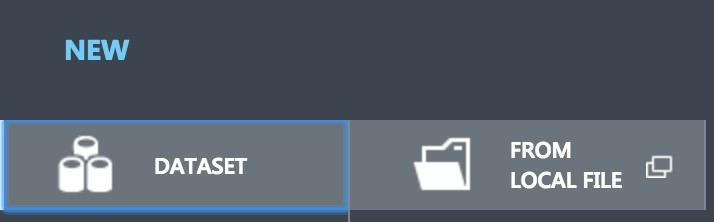
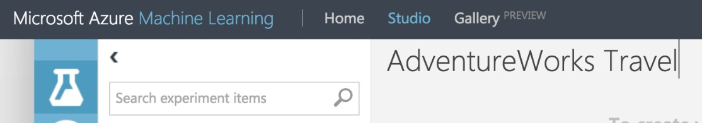
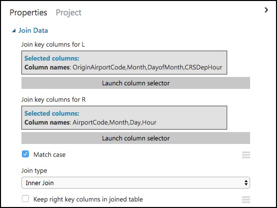

## **Exercise 1:** Build a Machine Learning Model

**Duration:** 60 minutes

**Synopsis:** In this exercise, attendees will implement a classification experiment. They will load the training data from their local machine into a dataset. Then, they will explore the data to identify the primary components they should use for prediction, and use two different algorithms for predicting the classification. They will evaluate the performance of both and algorithms choose the algorithm that performs best. The model selected will be exposed as a web service that is integrated with the sample web app. 

### **Task 1:** Navigate to Machine Learning Studio

  1.  In a browser, go to the Azure portal (https://portal.azure.com), and navigate to your Machine Learning Studio workspace under the Resource Group you created when completing the prerequisites for this hands-on lab. 
    

  2. On the Machine Learning Studio workspace blade, select **Launch Machine Learning Studio**.
    

  3. Sign in, if prompted.

  4.	If you have multiple Azure ML workspaces, choose the one you created for this     hands-on lab from the drop-down menu near the top right of Azure Machine Learning   Studio.
    
  


### **Task 2:** Upload the Sample Datasets 

  1.	Before you begin creating a machine learning experiment, there are three datasets you need to load.

  2.	Download the three CSV sample datasets from here: http://bit.ly/2wGAqrl (If you get an error, or the page won’t open, try pasting the URL into a new browser window and verify the case sensitive URL is exactly as shown).

  3.	Extract the ZIP and verify you have the following files:

  *	FlightDelaysWithAirportCodes.csv
  *	FlightWeatherWithAirportCodes.csv 
  *	AirportCodeLocationLookupClean.csv

  4.	In the Machine Learning Studio browser window, select **+ NEW** at the bottom left.

   

  5. Select **Dataset** under New, and then select **From Local File**.

  

  6.	In the dialog that appears, select **Choose File**, browse to the FlightDelaysWithAirportCodes.csv file you downloaded in the previous step, and select **Open**. 

  7.	**Change the name** of the dataset to "FlightDelaysWithAirportCodes," and **select the checkmark** to upload the data into a new dataset.

  

  8.	Repeat the previous step for the FlightWeatherWithAirportCode.csv and AirportCodeLocationsClean.csv files, setting the name for each dataset in a similar fashion.


### **Task 3:** Start a new experiment

  1.	Select **+ NEW** in the command bar at the bottom left of the page, and select **Experiment**.

  2. From the options that appear, select Blank Experiment.

  

  3.	Give your new experiment a name, such as AdventureWorks Travel by editing the "Experiment created on ..." label near the top of the design surface.   

  

### **Task 4:** Prepare flight delay data

  1.	In the toolbar on the left, in the **Search experiment items** box, type the name of the dataset you created with flight delay data (FlightDelaysWithAirportCodes). You should see a component for it listed under Saved Datasets, My Datasets.

  

  2.	**Select and drag** the FlightDelaysWithAirportCodes module onto the design surface.

  

  3.	Next, you will explore the Flight delays datasets to understand what kind of cleanup (e.g., data munging) will be necessary.

  4.	Hover over the output port of the **FlightDelaysWithAirportCodes** module. 

  

  5.	Right-click on the port and select **Visualize**.

  

  6.	A new dialog will appear showing a maximum of 100 rows by 100 columns sample of the dataset. You can see at the top that the dataset has a total of 2,719,418 rows (also referred to as examples in Machine Learning literature) and has 20 columns (also referred to as features).

   

  7.	Because all 20 columns are displayed, you can scroll the grid horizontally. Scroll until you see the **DepDel15** column, and select it to view statistics about the column. The DepDel15 column displays a 1 when the flight was delayed at least 15 minutes and 0 if there was no such delay. In the model you will construct, you will try to predict the value of this column for future data. Notice in the Statistics panel that a value of 27444 appears for Missing Values. This means that 27,444 rows do not have a value in this column. Since this value is very important to our model, we will need to eliminate any rows that do not have a value for this column.

  

  8.	Next, select the **CRSDepTime** column. Our model will approximate departure times to the nearest hour, but departure time is captured as an integer. For example, 8:37 am is captured as 837. Therefore, we will need to process the CRSDepTime column, and round it down to the nearest hour. To perform this rounding will require two steps, first you will need to divide the value by 100 (so that 837 becomes 8.37). Second, you will round this value down to the nearest hour (so that 8.37 becomes 8.)

  

9.	Finally, we do not need all 20 columns present in the FlightDelaysWithAirportCodes dataset, so we will need to pare down the columns in the dataset to the 12.

10.	Close the Visualize dialog, and go back to the design surface.

11.	To perform our data munging, we have multiple options, but in this case, we’ve chosen to use an **Execute R Script** module, which will perform the following tasks:
  *	Remove rows with missing values
  *	Generate a new column, named “CRSDepHour,” which contains the rounded down value from CRSDepTime
  *	Pare down columns to only those needed for our model

12.	To add the module, search for **Execute R Script** by entering **“Execute R”** into the Search experiment items box.

    

13.	**Drag this module** on to the design surface beneath your FlightDelaysWithAirportCodes dataset. Select the small circle at the bottom of the FlightDelaysWithAirportCodes dataset, drag and release when your mouse is over the circle found in the top left of the Execute R Script module. These circles are referred to as ports, and by taking this action you have connected the output port of the dataset with the input port of the Execute R Script module, meaning data from the dataset will flow along this path.

    

  14.	In the **Properties** panel for **Execute R Script** module, select the **Double Windows** icon to maximize the script editor.

  

  15.	Replace the script with the following (Press CTRL+A to select all then CTRL+V to paste)

```
# Import data from the input port
ds.flights <- maml.mapInputPort(1)

# Delete rows containing missing values
ds.flights <- na.omit(ds.flights)

# Round departure times down to the nearest hour, and export the result as a new column named "CRSDepHour"
ds.flights[, "CRSDepHour"] <- floor(ds.flights[, "CRSDepTime"] / 100) 

# Trim the columns to only those we will use for the predictive model
ds.flights = ds.flights[, c("OriginAirportCode","OriginLatitude", "OriginLongitude", "Month", "DayofMonth", "CRSDepHour", "DayOfWeek", "Carrier", "DestAirportCode", "DestLatitude", "DestLongitude", "DepDel15")]

# Export the cleaned up data set
maml.mapOutputPort("ds.flights");
```
16.	**Select the check mark** in the bottom right to save the script (Do not worry if the formatting is off before hitting the check mark.)

    

17.	Select Save on the command bar at the bottom to save your in-progress experiment.

    

18.	Select Run in the command bar at the bottom to run the experiment. 

    

19.	When the experiment is finished running, you will see a finished message in the top right corner of the design surface, and green check marks over all modules that ran.

    

20.	You should run your experiment whenever you need to update the metadata describing what data is flowing through the modules, so that newly added modules can be aware of the shape of your data (most modules have dialogs that can suggest columns, but before they can make suggestions you need to have run your experiment). 

21.	To verify the results of our R script, right-click the left output port (Result Dataset) of the Execute R Script module and select **Visualize**.

    

22.	In the dialog that appears, scroll over to **DepDel15** and select the column. In the statistics you should see that Missing Values reads 0.

    

23.	Now, select the **CRSDepHour** column, and verify that our new column contains the rounded hour values from our CRSDepTime column. 

    

24.	Finally, observe that we have reduced the number of columns from 20 to 12. Close the dialog.

    

25.	At this point the Flight Delay Data is prepared, and we turn to preparing the historical weather data. 

### **Task 5:** Prepare weather data

1.	To the right of the FlightDelaysWithAirportCodes dataset, add the **FlightWeatherWithAirportCodes** dataset. 

    

2.	Right-click the output port of the FlightWeatherWithAirportCodes dataset and select **Visualize**. 

    

3.	Observe that this data set has 406,516 rows and 29 columns. For this model, we are going to focus on predicting delays using WindSpeed (in MPH), SeaLevelPressure (in inches of Hg), and HourlyPrecip (in inches). We will focus on preparing the data for those features.

4.	In the dialog, select the **WindSpeed** column, and review the statistics. Observe that the Feature Type was inferred as String and that there are 32 Missing Values. Below that, examine the histogram to see that, even though the type was inferred as string, the values are all actually numbers (e.g. the x-axis values are 0, 6, 5, 7, 3, 8, 9, 10, 11, 13). We will need to ensure that we remove any missing values and convert WindSpeed to its proper type as a numeric feature. 

    

5.	Next, select the **SeaLevelPressure** column. Observe that the Feature Type was inferred as String and there are 0 Missing Values. Scroll down to the histogram, and observe that many of the features are of a numeric value (e.g., 29.96, 30.01, etc.), but there are many features with the string value of M for Missing. We will need to replace this value of "M" with a suitable numeric value so that we can convert this feature to be a numeric feature. 

    

6.	Finally, examine the **HourlyPrecip** feature. Observe that it too was inferred to have a Feature Type of String and is missing values for 374,503 rows. Looking at the histogram, observe that besides the numeric values, there is a value T (for Trace amount of rain). We need to replace T with a suitable numeric value and covert this to a numeric feature. 

    

7.	To preform our data cleanup, we will use a Python script, in which we will perform the following tasks:
  *	WindSpeed: Replace missing values with 0.0, and “M” values with 0.005

  *	HourlyPrecip: Replace missing values with 0.0, and “T” values with 0.005

  *	SeaLevelPressure: Replace “M” values with 29.92 (the average pressure)

  *	Convert WindSpeed, HourlyPrecip, and SeaLevelPressure to numeric columns

  *	Round “Time” column down to the nearest hour, and add value to a new column named “Hour”

  *	Eliminate unneeded columns from the dataset

8.	Add an **Execute Python Script** module below the FlightWeatherWithAirportCode module, and connect the output port of the FlightWeatherWithAirportCode module to the first input port of the Execute Python Script module. 

    

9.	In the Properties panel for the Execute Python Script:

  *	Set the Python Version to Anaconda 4.0/Python 3.5

  *	Select the Double Windows icon to open the script editor.

    

10.	Paste in the following script into the Python script window, and select the checkmark at the bottom right of the dialog (press CTRL+A to select all then CTRL+V to paste and then immediately select the checkmark -- don't worry if the formatting is off before hitting the checkmark).

```python
# imports 
import pandas as pd
import math

# The entry point function can contain up to two input arguments:
#   Param<dataframe1>: a pandas.DataFrame
#   Param<dataframe2>: a pandas.DataFrame
def azureml_main(dataframe1 = None, dataframe2 = None):
    
    # Round weather Time down to the next hour, since that is the hour for which we want to use flight dataframe1
    # Add the rounded Time to a new column named "Hour," and append that column to the dataframe1
    dataframe1["Hour"] = dataframe1["Time"].apply(roundDown)
    
    # Replace any missing HourlyPrecip and WindSpeed values with 0.0
    dataframe1["HourlyPrecip"] = dataframe1["HourlyPrecip"].fillna('0.0')
    dataframe1["WindSpeed"] = dataframe1["WindSpeed"].fillna('0.0')
    
    # Replace any WindSpeed values of "M" with 0.005
    dataframe1["WindSpeed"] = dataframe1['WindSpeed'].replace(['M'], '0.005')
    
    # Replace any SeaLevelPressure values of "M" with 29.92 (the average pressure)
    dataframe1["SeaLevelPressure"] = dataframe1['SeaLevelPressure'].replace(['M'], '29.92')
    
    # Replace any HourlyPrecip values of "T" (trace) with 0.005
    dataframe1["HourlyPrecip"] = dataframe1['HourlyPrecip'].replace(['T'], '0.005')
    
    # Convert our WindSpeed, SeaLevelPressure, and HourlyPrecip columns to numeric
    dataframe1[['WindSpeed','SeaLevelPressure', 'HourlyPrecip']] = dataframe1[['WindSpeed','SeaLevelPressure', 'HourlyPrecip']].apply(pd.to_numeric)

    # Pare down the variables in the Weather dataset to just the columns being used by the model
    df_result = dataframe1[['AirportCode', 'Month', 'Day', 'Hour', 'WindSpeed', 'SeaLevelPressure', 'HourlyPrecip']]
    
    # Return value must be of a sequence of pandas.DataFrame
    return df_result

def roundDown(x):
    z = int(math.floor(x/100.0))
    return z 
  ```

  11.	Run the experiment. Currently it should appear as follows: 

  

12.	If you receive an error in the Python script that .to_numeric does not exist, go back and verify that you selected the proper Python version.

13.	Right-click the first output port of the Execute Python Script module, and select **Visualize**. 

    

14.	In the statistics, verify that there are now only the 7 columns we are interested in, and that WindSpeed, SeaLevelPressure, and HourlyPrecip are now all Numeric Feature types and that they have no missing values. 

    

### **Task 6:** Join the Flight and Weather datasets

1.	With both datasets ready, we want to join them together so that we can associate historical flight delays with the weather data at departure time. 

2.	Drag a **Join Data** module onto the design surface, beneath and centered between both Execute R and Python Script modules. Connect the output port (1) of the Execute R Script module to input port (1) of the Join Data module, and the output port (1) of the Execute Python Script module to the input port (2) of the Join Data module. 

    

3.	In the **Properties** panel for the Join Data module, relate the rows of data between the two sets L (the flight delays) and R (the weather).

4.	Select **Launch Column selector** under **Join key columns for L**. Set the Join key columns for L to include OriginAirportCode, Month, DayofMonth, and CRSDepHour, and select the check box in the bottom right. 

    

5.	Select **Launch Column selector** under **Join key columns for R**. Set the join key columns for R to include AirportCode, Month, Day, and Hour, and select the check box in the bottom right. 

    

6.	Leave the Join Type at Inner Join, and uncheck **Keep right key columns in joined table** (so that we do not include the redundant values of AirportCode, Month, Day, and Hour). 

    

7.	Next, drag an **Edit Metadata** module onto the design surface below the Join Data module, and connect its input port to the output port of the Join Data module. We will use this module to convert the fields that were unbounded String feature types, to the enumeration like Categorical feature.

    

8.	On the **Properties** panel of the Edit Metadata module, select **Launch column selector** and set the Selected columns to DayOfWeek, Carrier, DestAirportCode, and OriginAirportCode, and select the checkbox in the bottom right. 

    

9.	Set the Categorical drop down to **Make categorical**. 

    

10.	Drag a **Select Columns in Dataset** module onto the design surface, below the Edit Metadata module. Connect the output of the Edit Metadata module to the input of the Select Columns in Dataset module. 

    

11.	Launch the column selector, and choose Begin With **All Columns**, choose **Exclude** and set the selected columns to exclude: OriginLatitude, OriginLongitude, DestLatitude, and DestLongitude. 

    

12.	Save your experiment. 

13.	Run the experiment to verify everything works as expected and when completed, Visualize by right-clicking on the output of the Select Columns in Dataset module. You will see the joined datasets as output. 

    

14.	The model should now look like the following. 

    

### **Task 7:** Train the model

AdventureWorks Travel wants to build a model to predict if a departing flight will have a 15-minute or greater delay. In the historical data they have provided, the indicator for such a delay is found within the DepDel15 (where a value of 1 means delay, 0 means no delay). To create a model that predicts such a binary outcome, we can choose from the various Two-Class modules that Azure ML offers. For our purposes, we begin with a Two-Class Logistic Regression. This type of classification module needs to be first trained on sample data that includes the features important to making a prediction and must also include the actual historical outcome for those features. 
The typical pattern is to split the historical data so a portion is shown to the model for training purposes, and another portion is reserved to test just how well the trained model performs against examples it has not seen before.

1.	To create our training and validation datasets, drag a **Split Data** module beneath Select Columns in Dataset, and connect the output of the Select Columns in Dataset module to the input of the Split Data module. 

      

2.	On the **Properties** panel for the Split Data module, set the Fraction of rows in the first output dataset to **0.7** (so 70% of the historical data will flow to output port 1). Set the Random seed to **7634**. 

    

3.	Next, add a Train Model module and connect it to output 1 of the Split Data module.

    

4.	On the **Properties** panel for the Train Model module, set the Selected columns to **DepDel15**.

    

5.	Drag a **Two-Class Logistic Regression** module above and to the left of the Train Model module and connect the output to the leftmost input of the Train Model module

    

6.	Below the Train Model drop a **Score Model** module. Connect the output of the Train Model module to the leftmost input port of the Score Model and connect the rightmost output of the Split Data module to the rightmost input of the Score Model.

    

7.	Save the experiment.

8.	Run the experiment.

9.	When the experiment is finished running (which takes a few minutes), right-click on the output port of the Score Model module and select **Visualize** to see the results of its predictions. **You should have a total of 13 columns**.

    

10.	If you scroll to the right so that you can see the last two columns, observe there are **Scored Labels** and **Scored Probabilities** columns. The former is the prediction (1 for predicting delay, 0 for predicting no delay) and the latter is the probability of the prediction. In the following screenshot, for example, the last row shows a delay predication with a 53.1% probability.

    

11.	While this view enables you to see the prediction results for the first 100 rows, if you want to get more detailed statistics across the prediction results to evaluate your model's performance, you can use the **Evaluate Model** module.

12.	Drag an **Evaluate Model** module on to the design surface beneath the Score Model module. Connect the output of the Score Model module to the leftmost input of the Evaluate Model module. 

    

13.	Run the experiment.

14.	When the experiment is finished running, right-click the output of the Evaluate Model module and select **Visualize**. In this dialog box, you are presented with various ways to understand how your model is performing in the aggregate. While we will not cover how to interpret these results in detail, we can examine the ROC chart that tells us that at least our model (the blue curve) is performing better than random (the light gray straight line going from 0,0 to 1,1)—which is a good start for our first model!

    

    

### **Task 8:** Operationalize the experiment

1.	Now that we have a functioning model, let us package it up into a predictive experiment that can be called as a web service.

2.	In the command bar at the bottom, select **Set Up Web Service** and then select **Predictive Web Service** **[Recommended]**. (If Predictive Web Service is grayed out, run the experiment again.

3.	A copy of your training experiment is created, and a new tab labeled **Predictive Experiment** is added, which contains the trained model wrapped between web service input (e.g. the web service action you invoke with parameters) and web service output modules (e.g., how the result of scoring the parameters are returned). 

    

4.	We will make some adjustments to the web service input and output modules to control the parameters we require and the results we return.

5.	Move the **Web Service Input** module down, so it is to the right of the Join Data module. Connect the output of the Web service input module to input of the Edit Metadata module.

  

6.	Right-click the line connecting the Join Data module and the Edit Metadata module and select **Delete**.

    

7.	In between the Join Data and the Edit Metadata modules, drop a **Select Columns in Dataset** module. Connect the Join Data module’s output to the Select Columns module’s input, and the Select Columns output to the Edit Metadata module’s input.

    

8.	In the Properties panel for the Select Columns in Dataset module, set the Select columns to **All Columns**, and select **Exclude**. Enter columns **DepDel15, OriginLatitude, OriginLongitude, DestLatitude,** and **DestLongitude**. 

    

9.	This configuration will update the web service metadata so that these columns do not appear as required input parameters for the web service.

    

10.	Select the Select Columns in Dataset module that comes **after the Metadata Editor module**, and delete it.

11.	Connect the output of the Edit Metadata module directly to the right input of the Score Model module.

    

12.	As we removed the latitude and longitude columns from the dataset to remove them as input to the web service, we have to add them back in before we return the result so that the results can be easily visualized on a map. 

13.	To add these fields back, begin by **deleting the line between the Score Model and Web service output**.

14.	Drag the **AirportCodeLocationLookupClean** dataset on to the design surface, positioning it below and to the right of the Score Model module.

    

15.	Add a **Join Data** module, and position it below and to the left of the AirportCodeLocationLookupClean module. 

16.	Connect the output of the **Score Model** module to the leftmost input of the **Join Data** module and the output of the **AirportCodeLocationLookupClean** dataset to the rightmost input of the **Join Data** module.

    

17. In the **Properties** panel for the Join Data module, for the Join key columns for L set the selected columns to **OriginAirportCode**. For the Join key columns for R, set the Selected columns to **AIRPORT**. Uncheck Keep right key columns in joined table.

    

18.	Add a **Select Columns in Dataset** module beneath the Join Data module. Connect the Join Data output to the input of the Select Columns in Dataset module.

    

19.	In the **Property** panel, begin with **All Columns**, and set the Selected columns to **Exclude** the columns: **AIRPORT_ID** and **DISPLAY_AIRPORT_NAME**.

    

20.	Add an **Edit Metadata** module. Connect the output of the Select Columns in Dataset module to the input of the Edit Metadata module.

  

21.	In the Properties panel for the Metadata Editor, use the column selector to set the Selected columns to **LATITUDE** and **LONGITUDE**. In the New column names enter: **OriginLatitude**, **OriginLongitude**.

  

22.	Connect the output of the Edit Metadata to the input of the web service output module.

  

23.	Run the experiment. 

  

24.	When the experiment is finished running, select **Deploy Web Service, Deploy Web Service [NEW] Preview**. 


25.	On the Deploy experiment page, select **Create New…** in the Price Plan drop down, and enter **Dev Test** as the Plan Name. Select **Standard DevTest (FREE)** under Monthly Plan Options. 


26.	Select **Deploy**.

27.	When the deployment is complete, you will be taken to the Web Service Quickstart page. Select the **Consume** tab. 


28.	Leave the Consume page open for reference during **Exercise 4, Task 1**. At that point, you need to copy the Primary Key and Batch Requests Uri (omitting the querystring – “?api-version=2.0

