## Exercise 2: Setup Azure Data Factory

**Duration:** 20 mins

**Synopsis:** In this exercise, attendees will create a baseline environment for Azure Data Factory development for further operationalization of data movement and processing. You will create a Data Factory service, and then install the Integration Runtime which is the agent that facilitates data movement from on-premises to Microsoft Azure.

### **Task 1:** Connect to the Lab VM

1.	NOTE: If you are already, connected to your Lab VM, skip to Task 2.

2.	From the left side menu in the Azure portal, click on **Resource groups**, then enter your resource group name into the filter box, and select it from the list.

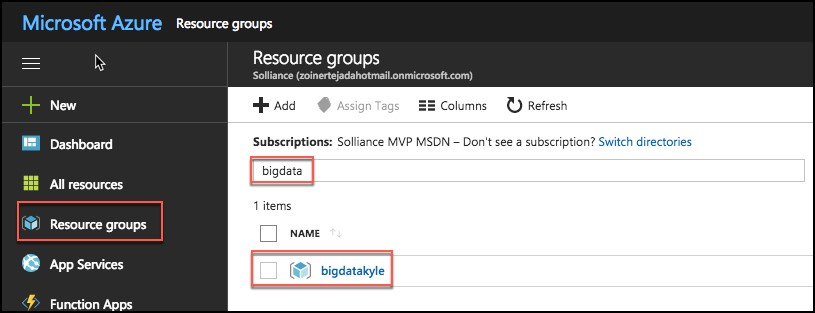 

3.  Next, select your lab virtual machine from the list. 

4.  On your Lab VM blade, select **Connect** from the top menu. 

5.	Download and open the RDP file.

6.	Select **Connect**, and enter the following credentials:
    * User name: demouser
    * Password: Password.1!!

### **Task 2:** Download and stage data to be processed

1.	Once you have logged into the Lab VM, open a web browser. A shortcut for Chrome is on the desktop.

2.	Download the AdventureWorks sample data from http://bit.ly/2zi4Sqa.

3.	Extract it to a new folder called **C:\Data**.

### **Task 3:** Install and configure Azure Data Factory Integration Runtime on the Lab VM

1.	To download the latest version of Azure Data Factory Integration Runtime, go to https://www.microsoft.com/en-us/download/details.aspx?id=39717

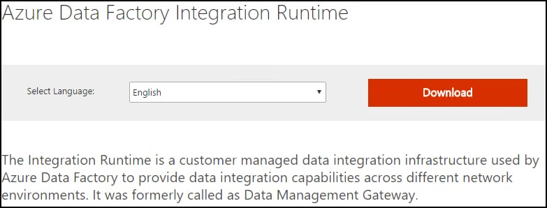

2.	Select **Download**, then choose the download you want from the next screen.

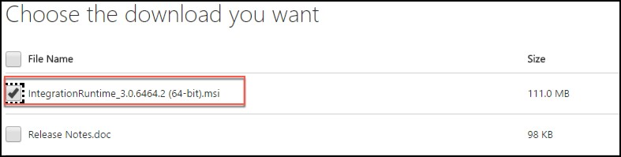

3.	Run the installer, once downloaded.

4.	When you see the following screen, select **Next**. 

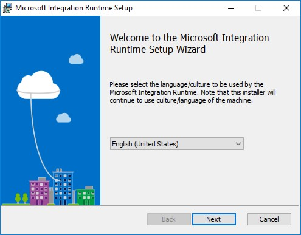

5.	Check the box to accept the terms and select **Next**. 

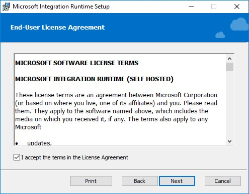

6.	Accept the default Destination Folder, and select **Next**. 

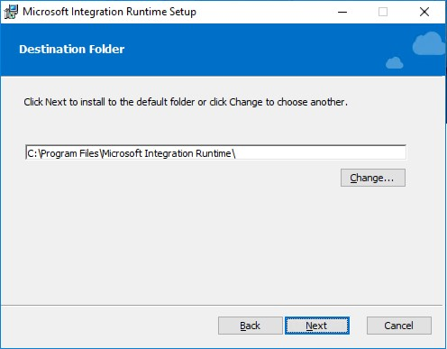

7.	Select **Install** to complete the installation. 

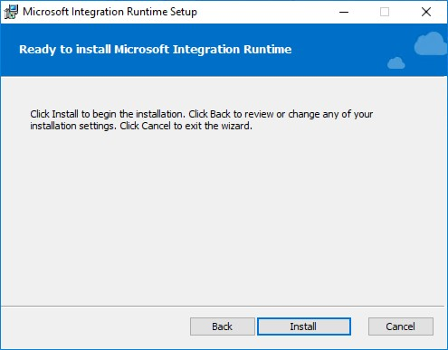

8.	Select **Finish** once the installation has completed. 

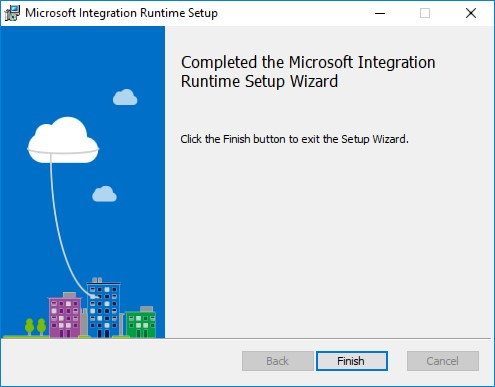

9.	After clicking Finish, the following screen will appear. Keep it open for now. We will come back to this screen once we have provisioned the Data Factory in Azure, and obtain the gateway key so we can connect Data Factory to this “on-premises” server

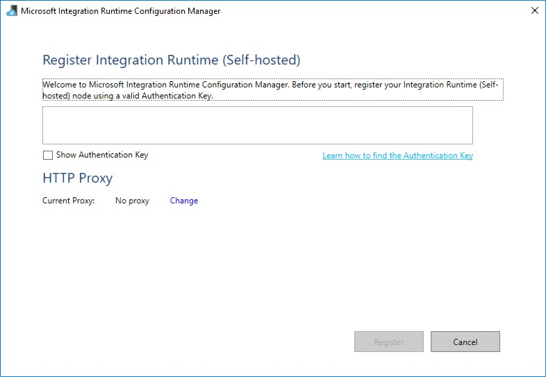

### **Task 4:** Create an Azure Data Factory

1.	Launch a new browser window, and navigate to the Azure portal (https://portal.azure.com). Once prompted, log in with your Microsoft Azure credentials. If prompted, choose whether your account is an organization account or a Microsoft account. This will be based on which account was used to provision your Azure subscription that is being used for this lab.
    *	**Note:** You may need to launch an InPrivate/Incognito session in your browser if you have multiple Microsoft accounts.

2.	From the top left corner of the Azure portal, select **+ Create a resource**, and select **Data + Analytics**, then select **Data Factory**. 

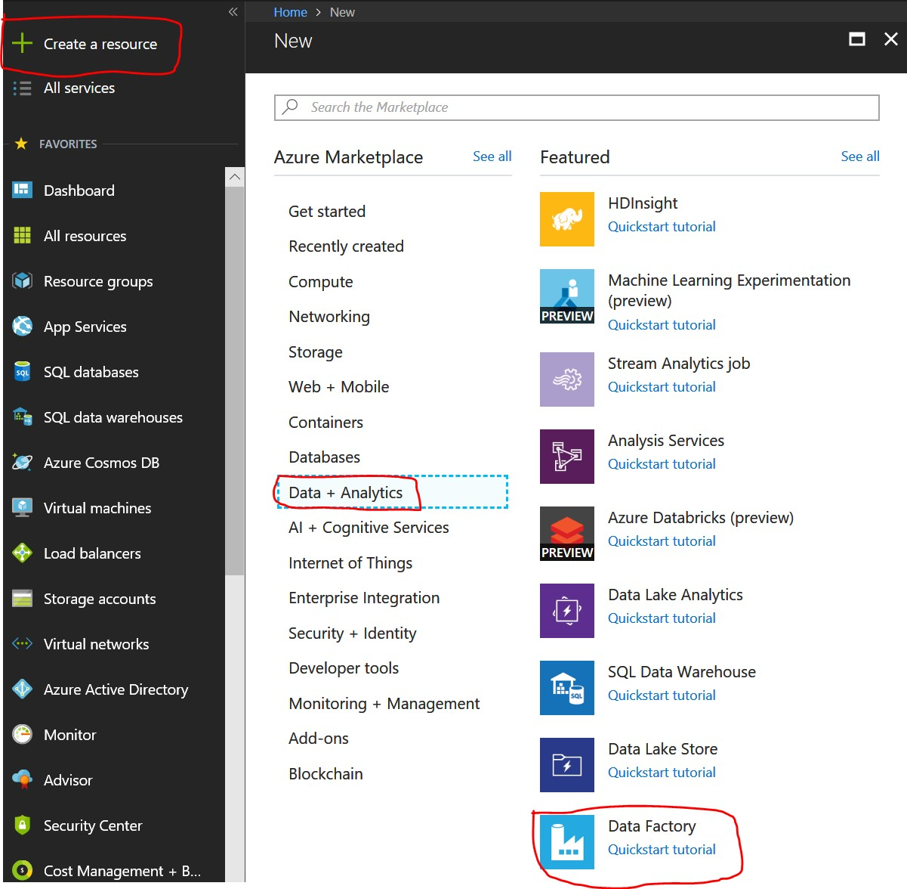

3.	On the New data factory blade, enter the following:
    *	Name: Provide a name, such as bigdata-adf
    *	Subscription: Select your subscription
    *	Resource Group: Choose Use existing, and select the Resource Group you created when deploying the lab prerequisites
    *	Version: Select V1
    *	Location: Select one of the available locations from the list nearest the one used by your Resource Group
    *	Select **Create**

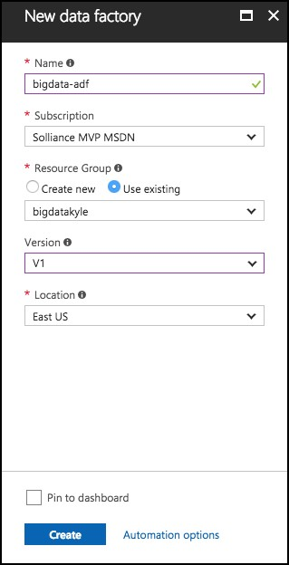

4.	The ADF deployment will take several minutes.

5.	Once the deployment is completed, you will receive a notification that it succeeded. 

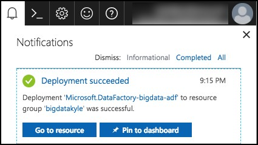

6.	Select the **Go to resource button**, to navigate to the newly created Data Factory.

7.	On the Data Factory blade, select **Author and Deploy** under Actions. 

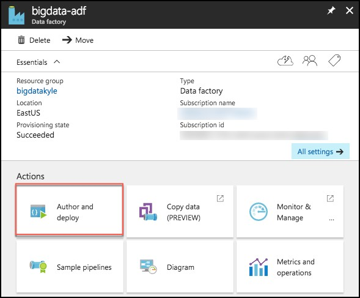

8.	Next, select …More, then New integration runtime (gateway).

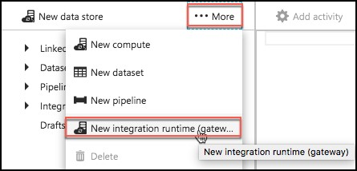

9.	Enter an Integration runtime name, such as bigdatagateway-[initials], and select **OK**. 

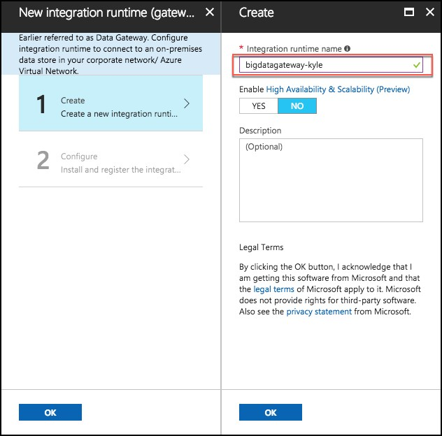

10.	On the Configure screen, copy the key1 value by selecting the Copy button, then select OK.

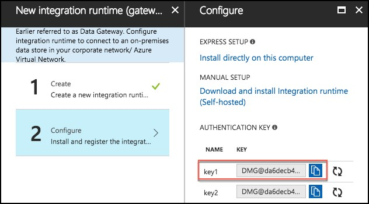

11.	_Don’t close the current screen or browser session_.

12.	Go back to the Remote Deskop session of the Lab VM.

13.	Paste the **key1** value into the box in the middle of the Microsoft Integration Runtime Configuration Manager screen.

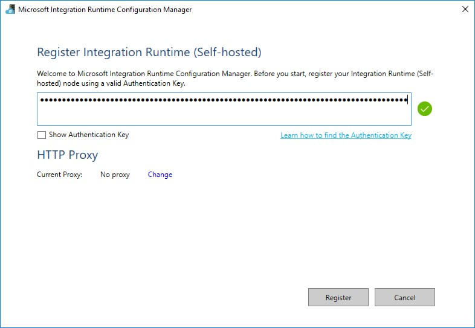

14.	Select **Register**.

15.	It will take a minute or two to register. If it takes more than a couple of minutes, and the screen does not respond or returns an error message, close the screen by clicking the **Cancel** button.

16.	The next screen will be New Integration Runtime (Self-hosted) Node. Select **Finish**. 

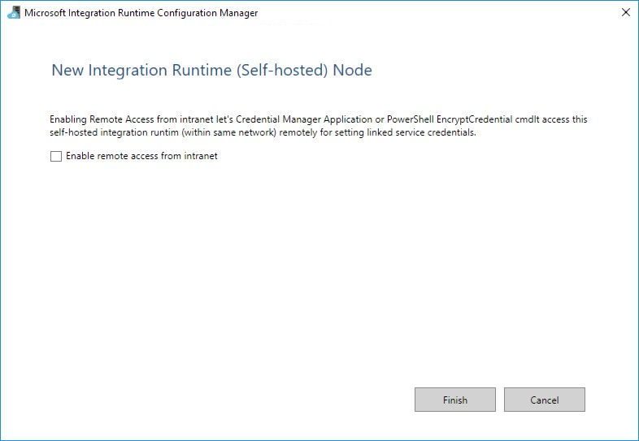

17.	You will then get a screen with a confirmation message. 

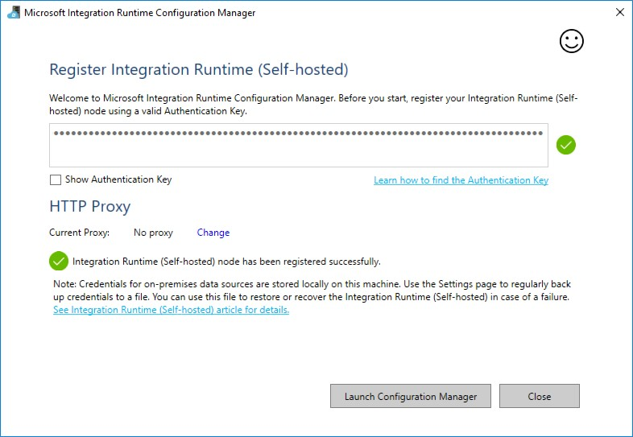

18.	Select the **Launch Configuration Manager** button to view the connection details. 

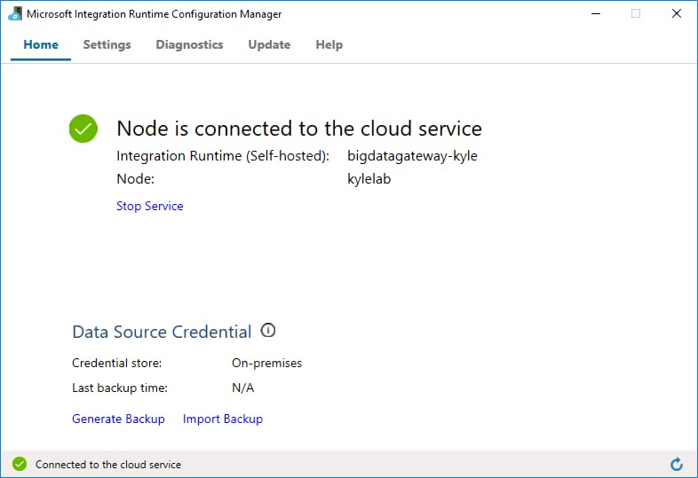

19.	You can now return to the Azure portal, and click **OK** twice to complete the Integration Runtime setup.

20.	You can view the Integration Runtime by expanding Integration runtimes on the Author and Deploy blade. 

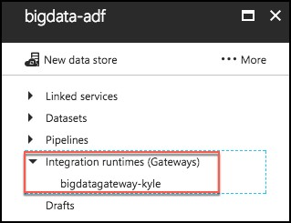

21.	Close the Author and Deploy blade, to return to the the Azure Data Factory blade. Leave this open for the next exercise.

