## **Exercise 3:** Develop a data factory pipeline for data movement

**Duration:** 20 mins

**Synopsis:** In this exercise, you will create an Azure Data Factory pipeline to copy data (.CSV file) from an on-premises server (Lab VM) to Azure Blob Storage. The goal of the exercise is to demonstrate data movement from an on-premises location to Azure Storage (via the Integration Runtime). You will see how assets are created, deployed, executed, and monitored.  

### **Task 1:** Create copy pipeline using the Copy Data Wizard

1.	On your Azure Data Factory blade in the Azure portal, select **Copy Data (PREVIEW)**, under Actions.

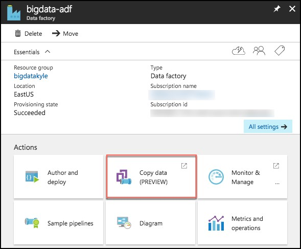

2.	This will launch a new browser window. Log in with the same credentials you used to create the Data Factory.

3.	In the new browser window, enter the following:
    *	Task name: Enter “CopyOnPrem2AzurePipeline”
    *  	Task description: (Optional) Enter a description, such as “This pipeline copies timesliced CSV files from on-premises virtual machine C:\\FlightsAndWeather to Azure Blob Storage as a continuous job.”
    *	Task cadence (or) Task schedule: Select Run regularly on schedule.
    *	Recurring pattern: Select Monthly, and every 1 month. 
    *	Start date time (UTC): Set to 03/01/2017 12:00 am
    *	End date time (UTC): Set to 12/31/2099 11:59 pm
    *	Select **Next** 
    
    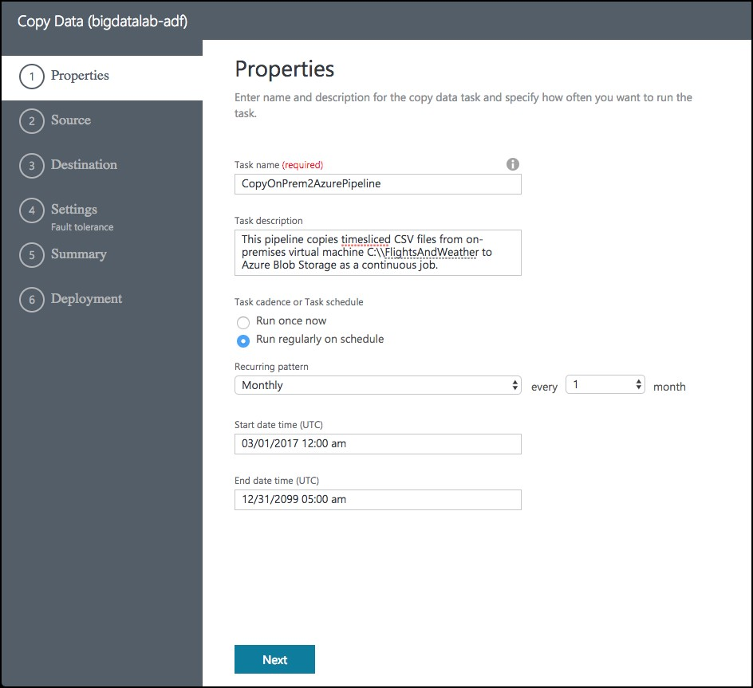

4.  On the Source screen, select **File System**, then select **Next**.   

    

5.	From the Specify File server share connection screen, enter the following:
    *	Connection name: **OnPremServer**
    *	Integration Runtime/Gateway: Select the Integration runtime created previously in this exercise (this value should already be populated)
    *	Path: Enter **C:\Data**
    *	Credential encryption: Select **By web browser**
    *	User name: Enter **demouser**
    *	Password: Enter **Password.1!!**
    *	Select **Next** 

    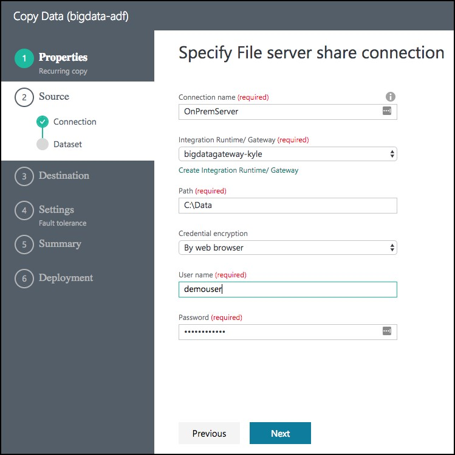

6.	On the Choose the input file or folder screen, select the folder **FlightsAndWeather**, and select Choose.

    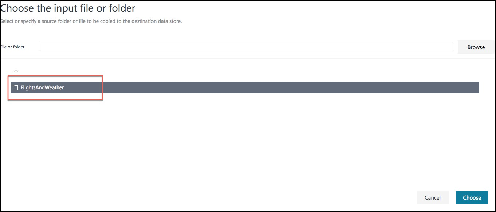

7.	On the next screen, check the **Copy files recursively** check box, and select **Next**. 

    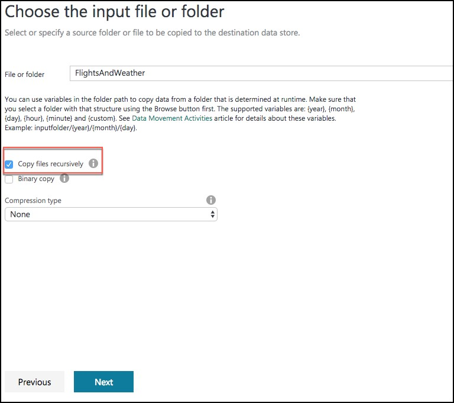

8.	On the File format settings page, leave the default settings, and select **Next**.

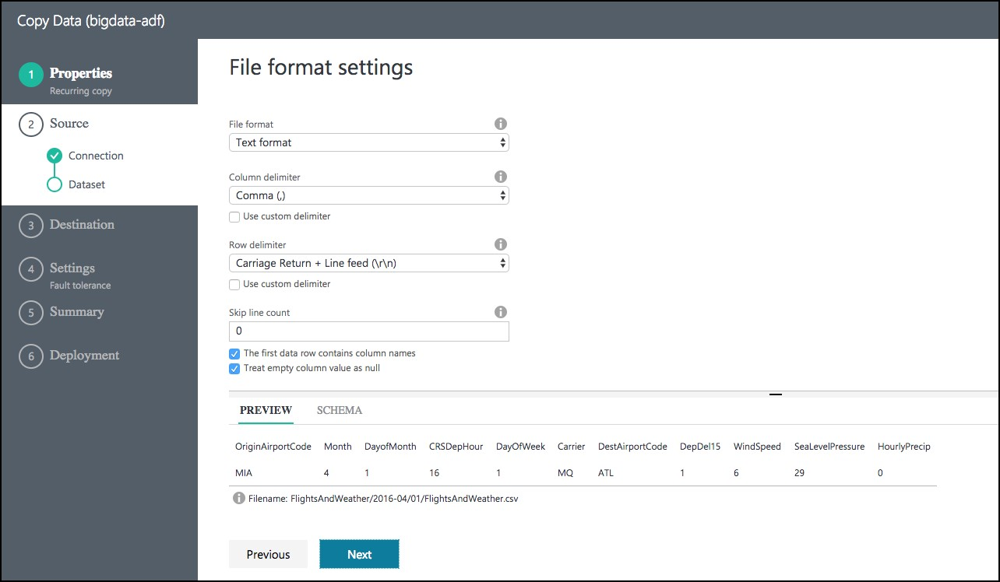 

9.	On the Destination screen, select **Azure Blob Storage**, and select **Next**. 

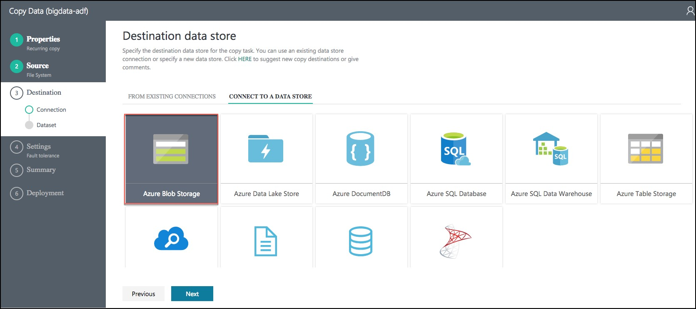

10.	On the Specify the Azure Blob storage account screen, enter the following:
    *	Connection name: BlobStorageOutput
    *	Account selection method: Leave as From Azure subscriptions
    *	Azure Subscription: Select your subscription 
    *	Storage account name: Select <YOUR_APP_NAME>sparkstorage. Make sure you select the storage account with the **sparkstorage** suffix, or you will have issues with subsequent exercises. This ensures data will be copied to the storage account that the Spark cluster users for its data files. 

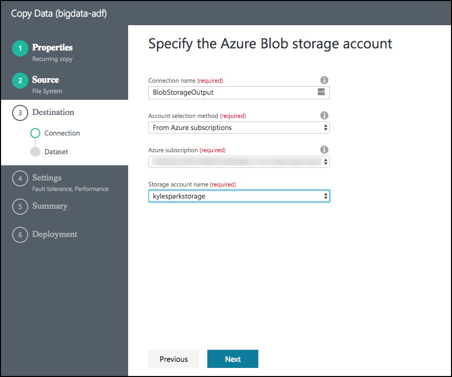

11.	Before selecting Next, please ensure you have selected the proper **sparkstorage** account. Finally, select **Next**.

12.	From the Choose the output file or folder tab, enter the following:
    *	Folder path: Enter **sparkcontainer/FlightsAndWeather/{Year}/{Month}/**
    *	Filename: Enter **FlightsAndWeather.csv**
    *	Year: Select **yyyy** from the drop down
    *	Month: Leave as **MM**
    *	Select **Next**. 

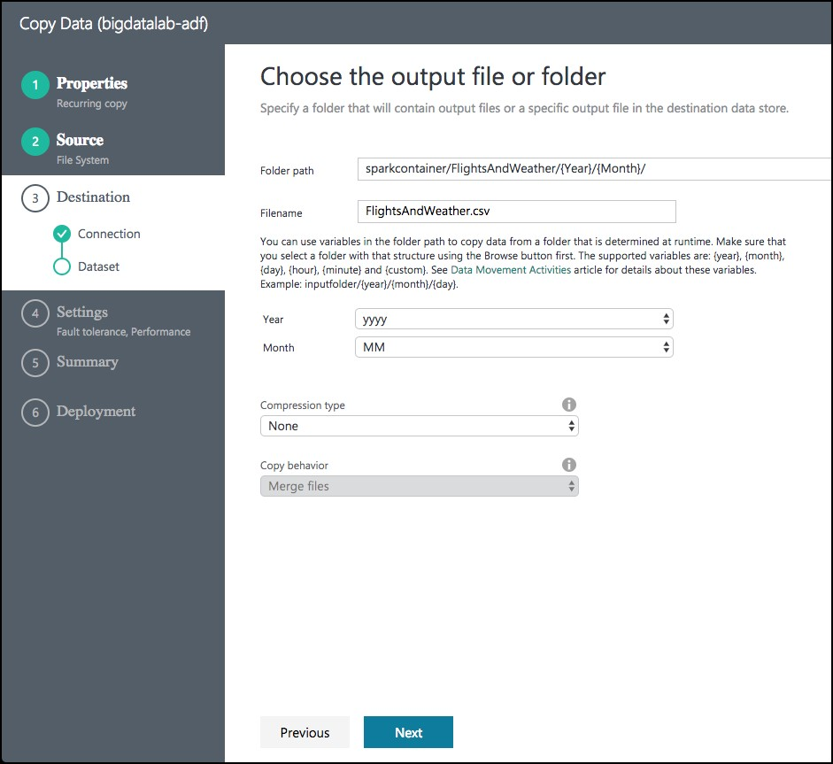

13.	On the File format settings screen, check the **Add header to file** checkbox, then select **Next**. 

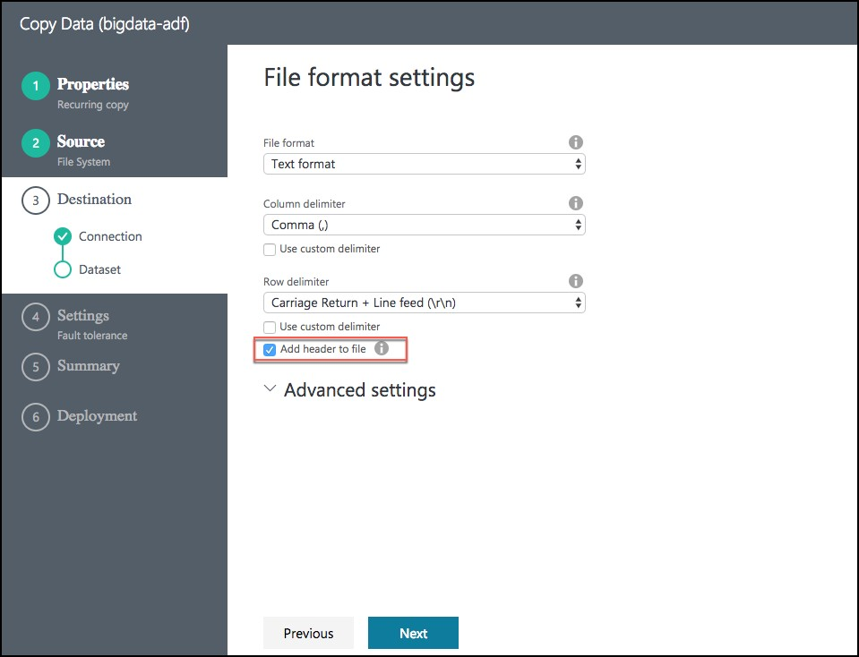

13.	On the Settings screen, select **Skip all incompatible rows** under Actions, then select **Next**. 

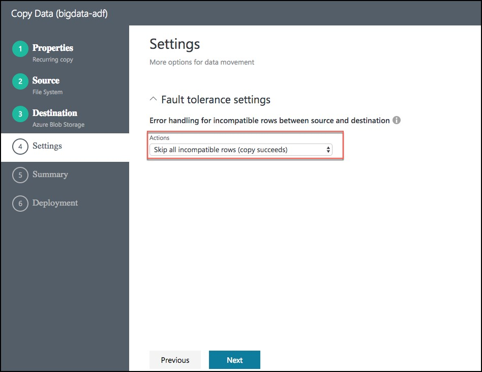

14.	Review settings on the Summary tab. 

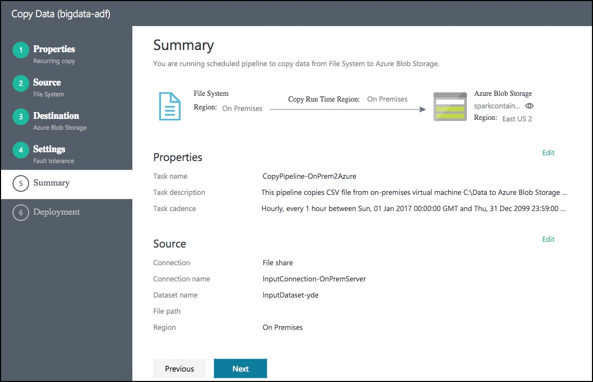

15.	Scroll down on the summary page until you see the **Copy Settings** section. Select **Edit** next to Copy Settings. 

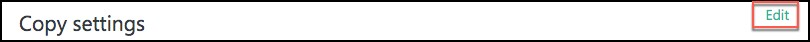

16.	Change the following Copy settings
    *	Concurrency: Set to **10**
    *	Execution priority order: Change to **OldestFirst**
    *	Select **Save** 

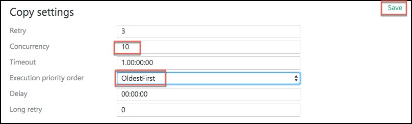

17.	After saving the Copy settings, select **Next** on the Summary tab.

18.	On the Deployment screen you will see a message that the deployment in is progress, and after a minute or two that the deployment completed. 

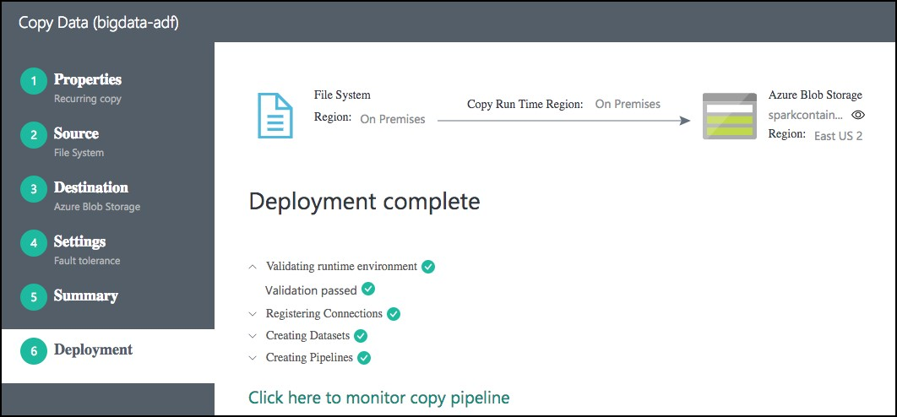

19.	Select the **Click here to monitor copy pipeline** link at the bottom of the **Deployment** screen.

20.	From the Data Factory Resource Explorer, you should see the pipeline activity status **Ready**. This indicates the CSV files are successfully copied from your VM to your Azure Blob Storage location. 

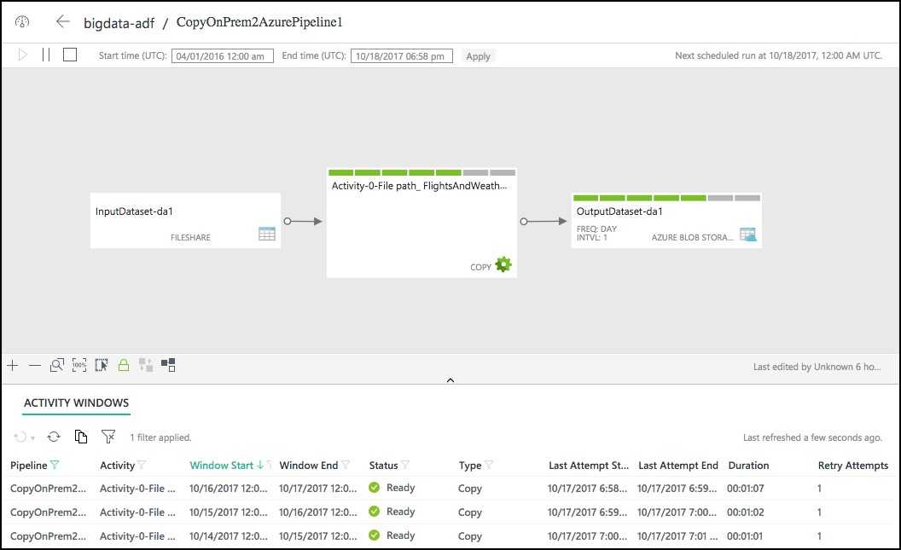

4.	You may need to adjust the Start time in the window, as follows, and then select **Apply**. 

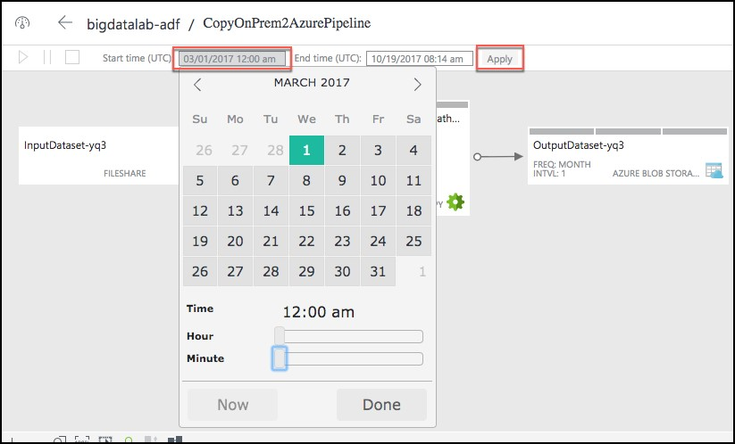

