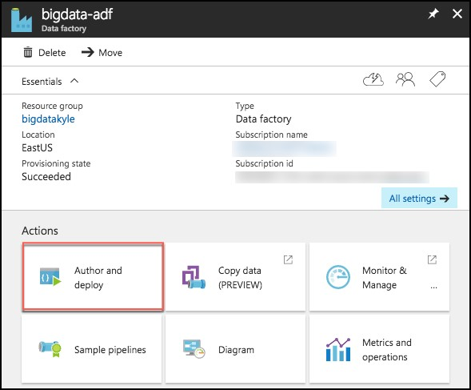
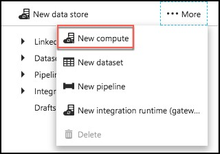
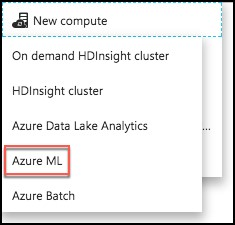
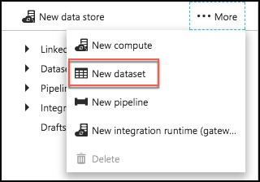
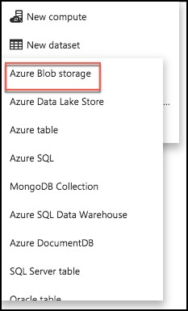
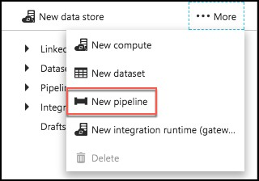
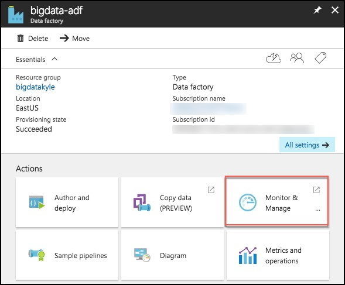
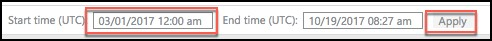

## **Exercise 4:** Operationalize ML scoring with Azure ML and Data Factory

**Duration:** 20 mins

**Synopsis:** In this exercise, you will extend the Data Factory to operationalize the scoring of data using the previously created Azure Machine Learning (ML) model. 

### **Task 1:** Create Azure ML Linked Service

1.	Return to the Azure Data Factory blade in the Azure portal

2.	Select **Author and Deploy** below Actions. 

    

3.	On the Author and Deploy blade, select **…More**, the select **New Compute**.

    

4.	Select Azure ML from the New Compute list.

    

5.	In the new window, replace the contents of the file with the following JSON.
    *   Back in Exercise 1, Task 9, you left your ML Web Service’s Consume page open. Return to that page, and copy and paste the following values into the JSON below.
    *	The value of **mlEndpoint** below is your web service’s **Batch Request URL**, remember to **remove the query string (e.g., “?api_version=2.0”).
    *	**apiKey** is the Primary Key of your web service. 
    *	Your tenant string should be populated automatically. 
    *	Delete the other optional settings (updateResourceEndpoint, servicePrincipalId, servicePrincipalKey). 

    ```json
    {
    "name": "AzureMLLinkedService",
    "properties": {
        "type": "AzureML",
        "description": "",
        "typeProperties": {
            "mlEndpoint": "<Specify the batch scoring URL>",
            "apiKey": "<Specify the published workspace model’s API key>",
            "tenant": "<Specify your tenant string>"
                            }
                    }
    }
```
```
6.	Select **Deploy**.

    

 ### **Task 2:** Create Azure ML input dataset

1.	Still on the Author and Deploy blade, select **…More** again. 

2.	To create a new dataset that will be copied into Azure Blob storage, select **New dataset** from the top. 

    

3.	Select **Azure Blob storage** from the list of available datasets.

    

4.	Replace the JSON text in the draft window with following JSON.

```JSON
{
    "name": "PartitionedBlobInput",
    "properties": {
        "published": false,
        "type": "AzureBlob",
        "linkedServiceName": "BlobStorageOutput",
        "typeProperties": {
            "fileName": "FlightsAndWeather.csv",
            "folderPath": "sparkcontainer/FlightsAndWeather/{Year}/{Month}/",
            "format": {
                "type": "TextFormat"
            },
            "partitionedBy": [
                {
                    "name": "Year",
                    "value": {
                        "type": "DateTime",
                        "date": "SliceStart",
                        "format": "yyyy"
                    }
                },
                {
                    "name": "Month",
                    "value": {
                        "type": "DateTime",
                        "date": "SliceStart",
                        "format": "MM"
                    }
                }
            ]
        },
        "availability": {
            "frequency": "Month",
            "interval": 1
        },
        "external": true,
        "policy": {}
    }
}

```
5.	Select **Deploy**.

    

 ### **Task 3:** Create Azure ML scored dataset

1.	Select **…More** again, and select **New dataset**.

    

2.	Select Azure Blob storage from the list of available datasets.

    

3.	Replace the JSON text in the draft window with following JSON.

```JSON
{
    "name": "ScoredBlobOutput",
    "properties": {
        "published": false,
        "type": "AzureBlob",
        "linkedServiceName": "BlobStorageOutput",
        "typeProperties": {
            "fileName": "Scored_FlightsAndWeather{Year}{Month}.csv",
            "folderPath": "sparkcontainer/ScoredFlightsAndWeather",
            "format": {
                "type": "TextFormat"
            },
            "partitionedBy": [
                {
                    "name": "Year",
                    "value": {
                        "type": "DateTime",
                        "date": "SliceStart",
                        "format": "yyyy"
                    }
                },
                {
                    "name": "Month",
                    "value": {
                        "type": "DateTime",
                        "date": "SliceStart",
                        "format": "MM"
                    }
                }
            ]
        },
        "availability": {
            "frequency": "Month",
            "interval": 1
        }
    }
}
```


4.	Select **Deploy**.

    


 ### **Task 4:** Create Azure ML predictive pipeline

1.	Select **…More** again, and select **New pipeline**.

    

2.	Replace the JSON text in the draft window with following JSON.

```JSON
{
    "name": "MLPredictivePipeline",
    "properties": {
        "description": "Use AzureML model",
        "activities": [
            {
                "type": "AzureMLBatchExecution",
                "typeProperties": {
                    "webServiceInput": "PartitionedBlobInput",
                    "webServiceOutputs": {
                        "output1": "ScoredBlobOutput"
                    },
                    "webServiceInputs": {},
                    "globalParameters": {}
                },
                "inputs": [
                    {
                        "name": "PartitionedBlobInput"
                    }
                ],
                "outputs": [
                    {
                        "name": "ScoredBlobOutPut"
                    }
                ],
                "policy": {
                    "timeout": "02:00:00",
                    "concurrency": 10,
                    "retry": 1
                },
                "scheduler": {
                    "frequency": "Month",
                    "interval": 1
                },
                "name": "MLActivity",
                "description": "prediction analysis on batch input",
                "linkedServiceName": "AzureMLLinkedService"
            }
        ],
        "start": "2017-03-01T00:00:00Z",
        "end": "2099-12-31T11:59:59Z",
        "isPaused": false,
        "pipelineMode": "Scheduled"
    }
}
```
3.	Select **Deploy**.

    


 ### **Task 5:** Monitor pipeline activities

1.	**Close the Author and Deploy blade**, and return to the Data Factory overview.

2.	Select **Monitor & Manage** under **Actions**. 

    

3.	Once again, you may need to shift the start time in order to see the items in progress and ready states.

    

4.	Close the Monitor & Manage browser tab.

