## **Exercise 5:** Summarize data using HDInsight Spark 

**Duration:** 20 mins

**Synopsis:** In this exercise, you will prepare a summary of flight delay data in HDFS using Spark SQL.

### **Task 1:** Install pandas on the HDInsight cluster
In this task, you will upgrade the version of panda on the HDInsight cluster, to ensure the Jupyter notebook’s autovixwidget has the necessary ‘api’ module installed.

1.	In the Azure portal, navigate to your HDInsight cluster, and from the Overview blade select Secure Shell (SSH). 

    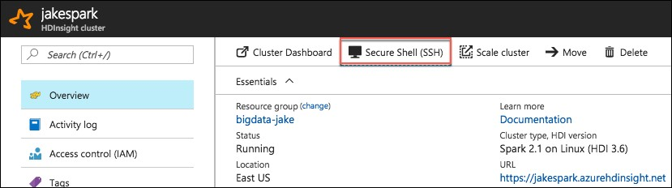

2.	On the SSH + Cluster login blade, select your cluster from the Hostname drop down, then select the copy button next to the SSH command. 

    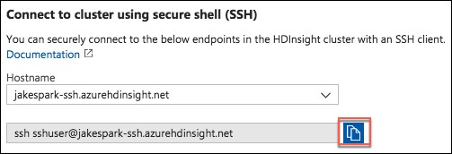

3.	On your Lab VM, open a **new Git Bash terminal** window.

4.	At the prompt, paste the SSH command you copied from your HDInsight SSH + Cluster login blade. 

    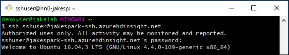

5.	Enter **yes**, if prompted about continuing, and **enter the following password** for the sshuser:
    *	Abc!1234567890

6.	At the sshuser prompt within the bash terminal, **enter the following command** to install pandas on the cluster:

    * sudo -HE /usr/bin/anaconda/bin/conda install pandas

### **Task 2:** Summarize delays by airport

1.	In the Azure portal (https://portal.azure.com), navigate to the blade for your Spark cluster. Do this by going to the resource group you created during the lab setup, using the Resource Group link in the left-hand menu. Once you select your resource group, you will see a list of the resources within that group, including your Spark cluster. Select your Spark cluster.

    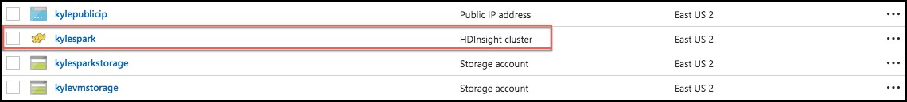

2.	In the **Quick links** section, select **Cluster dashboard**.

    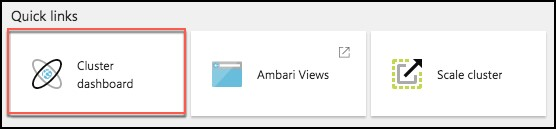

3.	From the **Cluster dashboards** blade, select **Jupyter Notebook**. 

    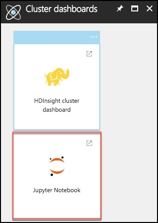

4.	Juptyer Notebook will open in a new browser window. **Log in** with the following credentials:
    *	User name: demouser
    *	Password: Password.1!!
    *	Note: If you get a 403 – Forbidden: Access is denied error, try to open the jupyter URL in a private or incognito browser window. You can also clear the browser cache.

5.	On the Jupyter Notebook screen, select **New**, and **Spark**. This will open a Jupyter notebook in a new browser tab.

    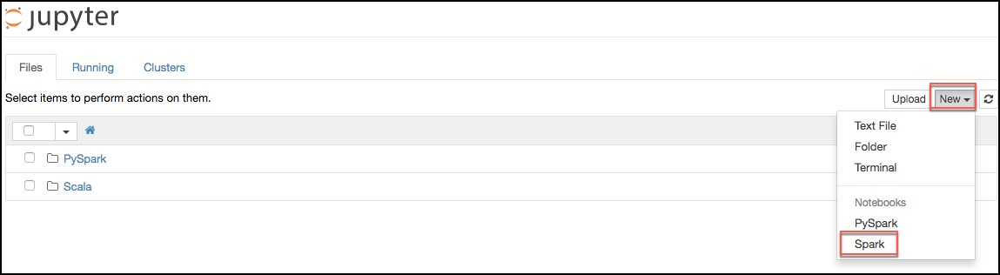

6.	**Copy the text below**, and **paste** it into the **first cell** in the Jupyter notebook. This will read the data from our Scored_FlightsAndWeather.csv file, and output it into a Hive table named “FlightDelays.”

```python
import spark.sqlContext.implicits._

val flightDelayTextLines = sc.textFile("/ScoredFlightsAndWeather/*.csv")

case class AirportFlightDelays(OriginAirportCode:String,OriginLatLong:String,Month:Integer,Day:Integer,Hour:Integer,Carrier:String,DelayPredicted:Integer,DelayProbability:Double)

val flightDelayRowsWithoutHeader = flightDelayTextLines.map(s => s.split(",")).filter(line => line(0) != "OriginAirportCode")

val resultDataFrame = flightDelayRowsWithoutHeader.map(
    s => AirportFlightDelays(
        s(0), //Airport code
        s(13) + "," + s(14), //Lat,Long
        s(1).toInt, //Month
        s(2).toInt, //Day
        s(3).toInt, //Hour
        s(5), //Carrier
        s(11).toInt, //DelayPredicted
        s(12).toDouble //DelayProbability
        )
).toDF()

resultDataFrame.write.mode("overwrite").saveAsTable("FlightDelays")

```

7.	The notebook should now look like the image below. 

    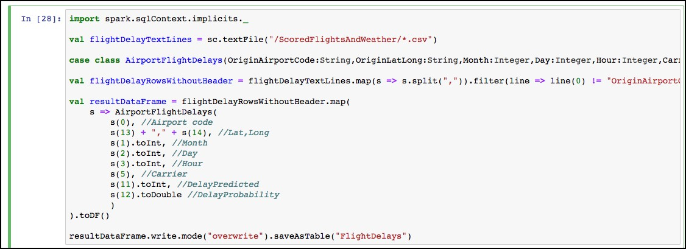

8.	Select the Run cell button on the toolbar. 

    

9.	You will see in asterisk appear between the brackets in front of the cell. 

    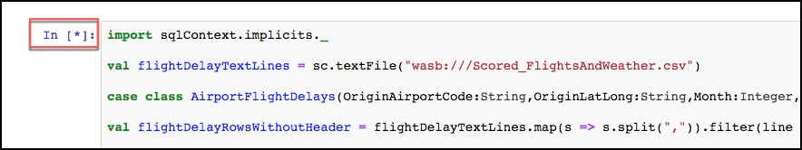

10.	This will change to a number once the command is complete.

    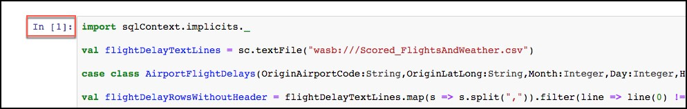

11.	Below the cell, you will see the output from executing the command. 

    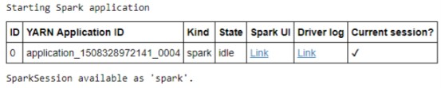

12.	Now, we can query the hive table which was created by the previous command. **Paste** the text below into the **empty cell** at the bottom on the notebook, and **select** the **Run cell** button for that cell.

```sql
%%sql

SELECT * FROM FlightDelays
```
13.	Once completed you will see the results displayed as a table. 

    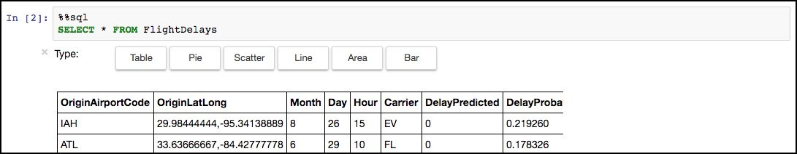

14.	Next, you will create a table that summarizes the flight delays data. Instead of containing one row per flight, this new summary table will contain one row per origin airport at a given hour, along with a count of the quantity of anticipated delays. In a **new cell** below the results of our previous cell, **paste** the following text, and **select** the **Run cell** button from the toolbar.

```sql
%%sql

SELECT  OriginAirportCode, OriginLatLong, Month, Day, Hour, Sum(DelayPredicted) NumDelays, Avg(DelayProbability) AvgDelayProbability 
FROM FlightDelays 
WHERE Month = 4
GROUP BY OriginAirportCode, OriginLatLong, Month, Day, Hour
Having Sum(DelayPredicted) > 1
```

15.	Execution of this cell should return a results table like the following. 

    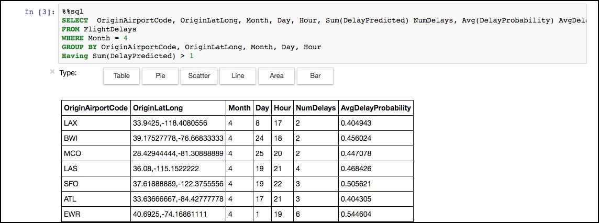

16.	Since the summary data looks good, the final step is to save this summary calculation as a table, which we can later query using Power BI (in the next exercise).

17.	To accomplish this, **paste** the text below into a **new cell**, and **select** the **Run cell** button from the toolbar.

```python
val summary = spark.sqlContext.sql("SELECT  OriginAirportCode, OriginLatLong, Month, Day, Hour, Sum(DelayPredicted) NumDelays, Avg(DelayProbability) AvgDelayProbability FROM FlightDelays WHERE Month = 4 GROUP BY OriginAirportCode, OriginLatLong, Month, Day, Hour Having Sum(DelayPredicted) > 1")
summary.write.mode("overwrite").saveAsTable("FlightDelaysSummary")
```
18.	To verify the table was successfully created, go to another **new cell**, and **enter the following query**.

```sql
%%sql

SELECT * FROM FlightDelaysSummary

```
19.	Select the Run cell button on the toolbar. 

    

20.	You should see a results table similar to the following. 

   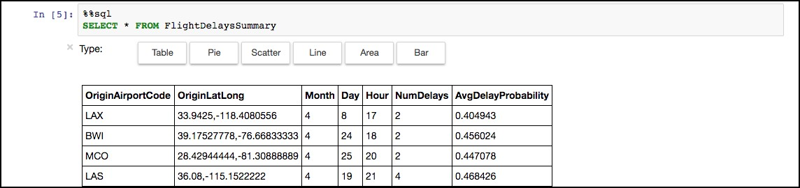
21.	You can also select Pie, Scatter, Line, Area, and Bar chart visualizations of the dataset.
