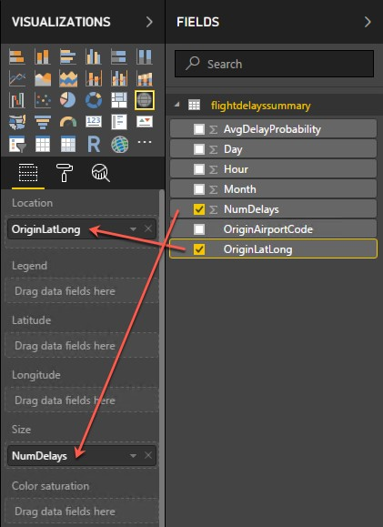

## **Exercise 6:** Visualizing in Power BI Desktop 

**Duration:** 20 mins

**Synopsis:** In this exercise, you will create a Power BI Report to visualize the data in HDInsight Spark.

### **Task 1:** Connect to the Lab VM

1.	NOTE: If you are already, connected to your Lab VM, skip to Task 2.

2.	From the left side menu in the Azure portal, click on **Resource groups**, then enter your resource group name into the filter box, and select it from the list. 

    

3.	Next, select your lab virtual machine from the list. 

    

4.	On your Lab VM blade, select **Connect** from the top menu. 

    

5.	**Download** and **open** the RDP file.

6.	Select **Connect**, and enter the following credentials:
    *	User name: demouser
    *	Password: Password.1!!

### **Task 2:** Connect to HDInsight Spark using Power BI Desktop

1.	On your Lab VM, launch Power BI Desktop by **double-clicking on the desktop shortcut** you created in the pre-lab setup.

2.	When Power BI Desktop opens, you will need to **enter your personal information**, or **Sign in** if you already have an account.

    

3.	Select **Get data** on the screen that is displayed next. 

    

4.	Select **Azure** from the left, and select **Azure HDInsight Spark (Beta)** from the list of available data sources. 

    

5.	Select **Connect**.

6.	You will receive a prompt warning you that the Spark connector is still in preview. Select **Continue**. 

    

7.	On the next screen, you will be prompted for your HDInsight Spark cluster URL. 

    

8.	To find your Spark cluster URL, go into the **Azure portal**, and navigate to your **Spark cluster**, as you did in **Exercise 5, Task 1**. Once on the cluster blade, look for the URL under the **Essentials** section 

    

9.	Copy the URL, and **paste it into the Server box** on the Power BI Azure HDInsight Spark dialog. 

    

10.	Select **DirectQuery** for the Data Connectivity mode, and select **OK**.

11.	Enter your credentials on the next screen as follows. 
    *	User name: demouser
    *	Password: Password.1!!

    

12.	Select **Connect**.

13.	In the Navigator dialog, **check the box** next to **flightdelayssummary**, and select **Load**. 

    

14.	It will take several minutes for the data to load into the Power BI Desktop client.

### **Task 3:** Create Power BI report

1.	Once the data finishes loading, you will see the fields appear on the far right of the Power BI Desktop client window.

    

2.	From the Visualizations area, next to Fields, select the Globe icon to add a Map visualization to the report design surface.

    

3.	With the Map visualization still selected, drag the **OriginLatLong** field to the **Location** field under Visualizations.

    

4.	Next, drag the **NumDelays** field to the **Size** field under Visualizations.

    

5.	You should now see a map that looks similar to the following (resize and zoom on your map if necessary): 

     

6.	**Unselect** the Map visualization by clicking on the white space next to the map in the report area.

7.	From the Visualizations area, select the **Stacked Column Chart** icon to add a bar chart visual to the report’s design surface. 

    

8.	With the Stacked Column Chart still selected, drag the **Day** field and drop it into the **Axis** field located under Visualizations.

9.	Next, drag the **AvgDelayProbability** field over, and drop it into the **Value** field. 

   

10.	Grab the corner of the new Stacked Column Chart visual on the report design surface, and drag it out to make it as wide as the bottom of your report design surface. It should look something like the following. 

    

11.	**Unselect** the **Stacked Column Chart** visual by clicking on the white space next to the map on the design surface.

12.	From the Visualizations area, select the **Treemap** icon to add this visualization to the report. 

    

13. With the Treemap visualization selected, drag the **OriginAirportCode** field into the **Group** field under Visualizations.

14.	Next, drag the **NumDelays** field over, and drop it into the **Values** field.    

    

15.	Grab the corner of the Treemap visual on the report design surface, and expand it to fill the area between the map and the right edge of the design surface. The report should now look similar to the following. 

    

16. You can cross filter any of the visualizations on the report by clicking on one of the other visuals within the report, as shown below. (This may take a few seconds to change, as the data is loaded.)    

    

17.	You can save the report, by clicking **Save** from the **File** menu, and entering a name and location for the file. 

    