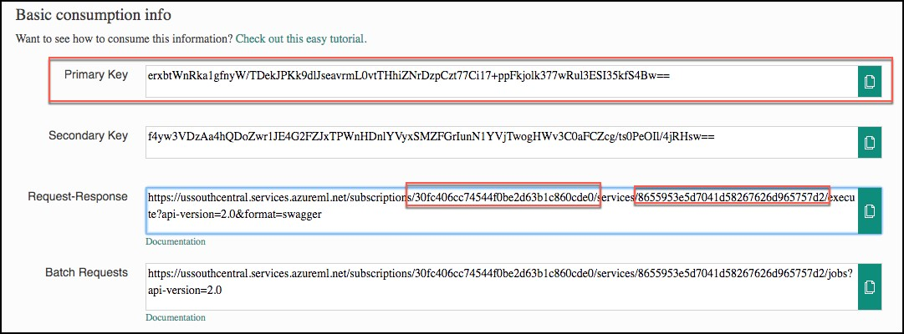
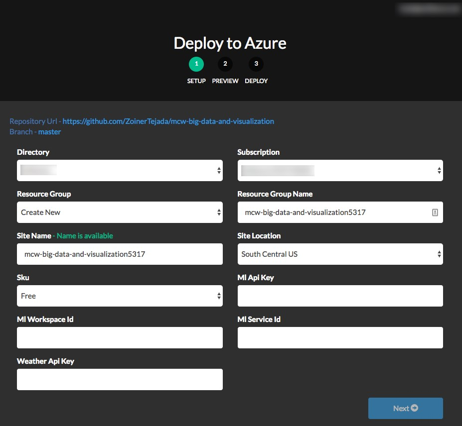

## **Exercise 7:** Deploy Intelligent Web App

**Duration:** 20 mins

**Synopsis:** In this exercise, you will deploy an intelligent web application to Azure from GitHub. This application leverages the operationalized machine learning model that was deployed in Exercise 1 to bring action-oriented insight to an already existing business process.

### **Task 1:** Deploy web app from GitHub

1.	Navigate to https://github.com/ZoinerTejada/mcw-big-data-and-visualization/blob/master/AdventureWorksTravel/README.md in your browser of choice, but where you are already authenticated to the Azure portal. 

2.	Read through the README information on the GitHub page and capture the required parameters.

3.	Click the **Deploy to Azure** button. 

    

4.	On the following page, ensure the fields are populated correctly. 
    *	Ensure the correct Directory and Subscription are selected.
    *	Select the Resource Group that you have been using throughout this lab.
    *	Either keep the default Site name, or provide one that is globally unique, and then choose a Site Location.
    *	Finally, enter the ML API and Weather API information. 
        *	Recall that you recorded the ML API information back in Exercise 1, Task 9.
            1.	This information can be obtained on your Machine Learning web service page (https://services.azureml.net, then go to the **Consume** tab.
            2.	The Primary Key listed is your ML API key
            3.	In the Request-Response URL, the **GUID after subscriptions/** is your **ML Workspace Id**
            4.	In the Request-Response URL, the **GUID after services/** is your **ML Service Id**

    

    * Also, recall that you obtained the **Weather API key** back in the **Task 3** of the **prerequisite steps** for the lab. Insert that key into the **Weather Api Key field**. 

    

5.	Select **Next**, and on the following screen, select **Deploy**.

6.	The page should begin deploying your application while showing you a status of what is currently happening. 

**NOTE:** If you run into errors during the deployment that indicate a bad request or unauthorized, verify that the user you are logged into the portal with an account that is either a Service Administrator or a Co-Administrator. You won’t have permissions to deploy the website otherwise.

7.	After a short time, the deployment will complete, and you will be presented with a link to your newly deployed web application. **CTRL+Click** to open it in a new tab.

8.	Try a few different combinations of origin, destination, date, and time in the application. The information you are shown is the result of both the ML API you published, as well as information retrieved from the Weather Underground API.

9.	**Congratulations!** You have built and deployed an intelligent system to Azure.
